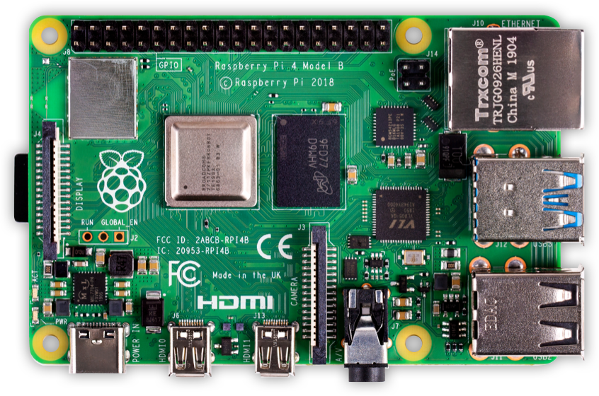
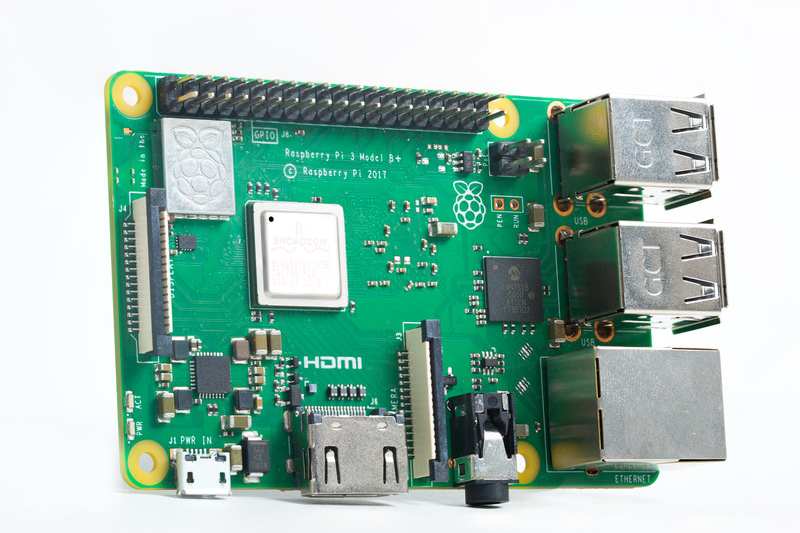
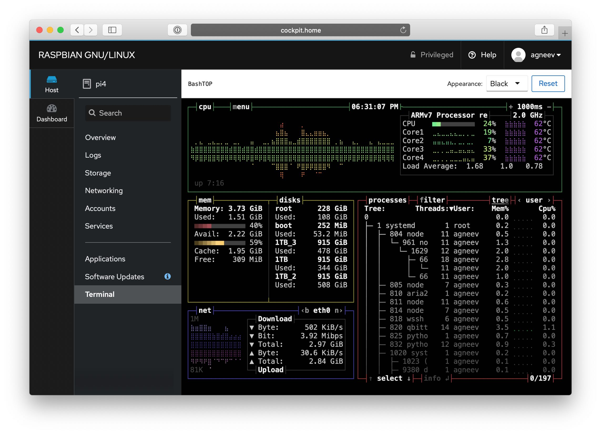
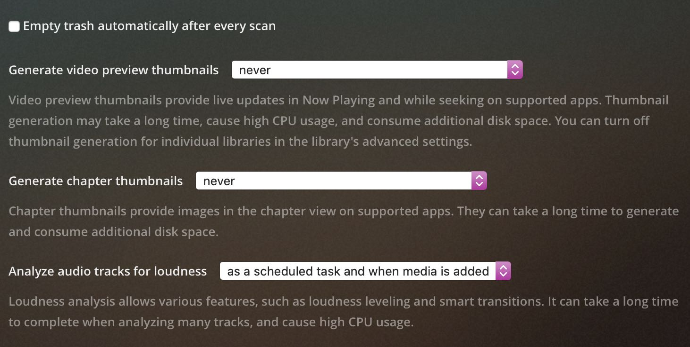

# My Server Setup

My server setup at home

Most of the code/files are in their folders in this repository.

- [My Server Setup](#my-server-setup)
  * [Hardware](#hardware)
    + [Primary server](#primary-server---pi4--)
    + [Secondary server](#secondary-server---always-on--)
  * [Software](#software)
    + [Smart home](#smart-home)
    + [System monitoring](#system-monitoring)
    + [Others](#others)
  * [File management](#file-management)
    + [rclone](#rclone)
    + [mergerFS](#mergerfs)
  * [Media management](#media-management)
  * [Backups and updates](#backups-and-updates)
  * [Notes](#notes)


## Hardware
I run two servers at home, currently. The primary is a Raspberry Pi 4 and the secondary is a Raspberry Pi 3B+.



### Primary Server (`pi4`) 
* Raspberry Pi 4 (4GB model)
  * overclocked to 1.95GHz<sup>[1](#fn1)</sup>
  * Raspberry Pi OS Debian Buster
* [Aluminum heatsink](https://shop.pimoroni.com/products/aluminium-heatsink-case-for-raspberry-pi-4?variant=29430673178707) 🌡
* Sandisk Ultra microSD card (8GB) - boot 
* Primary storage 📀
  * Crucial MX500 SSD (256GB) w/ Orico USB 3.0 enclosure
* Powered USB 3.0 hub 
  * TP-Link TL-UH700
* Secondary storage 💾
  * (x1) Seagate Expansion 4TB 
  * (x1) Seagate Barracuda 2.5" 1TB w/ Orico enclosure
  * (x1) WD My Passport 1TB
  * (x1) Sony 2.5" External HDD 1TB
* Gigabit Ethernet 🌐
* AUX out to soundbar 🎵

The heat sink is required because the Pi is overclocked and runs very hot. With it, temperatures are lowered and there is no CPU throttling unless the server is under very heavy loads.
I opted to not use a fan because they are not reliable and very noisy.



### Secondary Server (`always-on`) 
* Raspberry Pi 3B+
  * Raspberry Pi OS Lite - Debian Buster
* 16GB microSD card

`always-on` functions as a DNS server and runs limited software.

## Software
I run a lot of FOSS software and applications on my servers.

An inexhaustible list:

* Plex Media Server 📽
  * Tautulli 📊
  * Kitana
  * `plex-autoscan`
* rclone 💾
* VS Code (`code-server`) 👨‍💻
* *arrs ⏳
   * Radarr, Sonarr, Lidarr, Bazarr and Jackett
* qBittorrent 🧲
  * `qb-web` front-end
  * `qbittorrent-bot`
* aria2 (my preferred HTTP downloader) ⏬
  * `webui-aria2`
  * `tele-aria2`
* rtorrent ⬇️
  * flood front-end
  * `rutorrent` alt. front-end
* Shairport-Sync 🎶
* `cloud-torrent` ⤵️
* AdGuard Home 🌎
* Raspotify 🎶

### Smart Home
* Home Assistant ([separate repo](https://github.com/agneevx/my-ha-setup))
* Homebridge 📱
* Node-RED 🧩



### System Monitoring
* Cockpit ✈️
* Webmin - Web admin panel 🛠
* Netdata 👀
* `webssh`
* `vnstat`, `iftop`, `ncdu`, `nmon` and `iostat`

### Others
* mergerFS
* Samba File Sharing (SMB)
* Librespeed - LAN speed tests for diagnostics 
* `speedtest` - official Speedtest.net CLI
* Nginx 💻
  * Organizr v2 (using PHP 7.1)

All third-party software are located at `/opt`


## File management 🗃

I store data both locally and in the cloud. Less accessed files are stored in the cloud and more important/frequently accessed files or rather large files are stored locally.

### rclone ☁️

rclone is used to access and transfer files to/from the cloud. Most of my files are stored there. rclone is also used for backups.

At startup, a systemd unit file mounts the cloud drive to the filesystem root, `/drive` and caches the entire file structure in memory.
This results in no delay when loading folders or when Plex scans my media libraries.

The mount also enables access of files by running applications, and Plex is able to directly stream from the cloud as if were a local filesystem.

The mount options I use ensure the accessed data is buffered in memory before being sent to the client, which results in better responsiveness and throughput.

rclone's vast array of utilities let's me use it as an alternative to `rsync`, `md5sum` or `du`.

### mergerFS 💿

All of my hard disks are formatted in `ext4` (with no reserved space) and are mounted inside `/mnt/pool` at startup by `fstab`.

At startup, mergerFS creates a FUSE mount and combines all of these drives into a single mount point, `/merged`. I use a systemd mount file for this purpose.

This way, I am able to store and access all my files from a single mount point. 

## Media management ⏯

I use Plex to play content on my devices from my server, simply because there is no other media server that has broader support and better UX than Plex.
Both `/merged` and `/drive` are added to Plex because I store media in both places.

Tautulli tracks and stores details of playback and generates statistics and graphs from the information. I use Kitana to manage plugins on my Plex Media Server.

I use a forked version of the [`Plex-Trakt-Scrobbler`](https://github.com/rg9400/Plex-Trakt-Scrobbler) plugin that allows me to store and sync watched details and media information to Trakt.tv, which is a fantastic service I use to track movies and TV shows that I'm watching.
On my phone, I use Varys, Watcht, Tautulli and Plex to keep track of my media and what I'm watching.

Because of my media files cloud being stored in the cloud, there are certain options I have made to prevent unnecessary data use:



<b>*arrs</b> ⤵️

The process of grabbing new content for playback in Plex is automated via software aka *arrs. They aren't perfect but they're the best way to manage media content.

Radarr is used for movies, Sonarr for TV Shows.
Lidarr and Bazarr is used for music and subtitles respectively, but I do not actively use them.

Currently, I'm running the beta versions of Radarr (`aphrodite` branch) and Sonarr (`phantom-develop` branch). 

Depending on the content, I either download and keep a 1080p version or a 4K version.
Radarr and Sonarr automatically upgrade versions, so a 1080p WEB-DL automatically upgrades to a 1080p Blu-Ray when it becomes available.

My preferred torrent downloader I use is qBittorrent as it's most compatible and because I have had very less issues with it over time.

I use StevenLu's list only for Radarr auto-import.

Sonarr Release profiles:


## Backups and updates ↕️

Every day at 9PM, a couple of scripts run that backup certain important files to my cloud drive using rclone.

Every Sunday at 9PM, a script runs on both servers that automatically update its software.

These tasks are done by cron jobs and use Healthchecks.io for status reporting. Further I'm able to receive notifications on my phone with the Healthchecks telegram bot if these jobs do not complete

All backup scripts are under the `backup` folder inside `scripts`.

## Notes 💬

* Some applications have a delayed startup (by cron job)
```text
@reboot sleep 40 && sudo systemctl start drive radarr sonarr home-assistant@homeassistant raspotify
```

<b id="fn1">1.</b> 
`/boot/config.txt`: [↩](#a1)
```text
over_voltage=4
arm_freq=1950
```